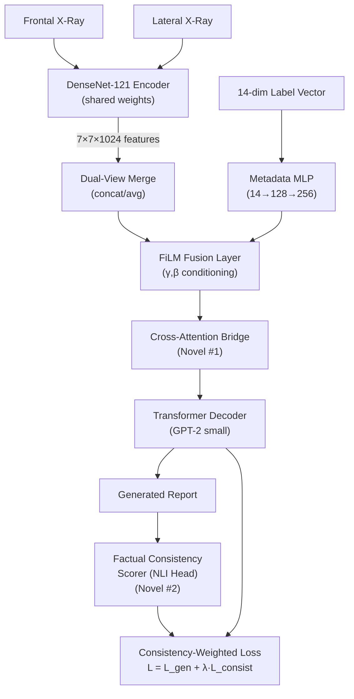

# Multimodal Medical Report Generation System

A vision encoder + LLM decoder pipeline with FiLM fusion, cross-attention bridge, and factual consistency scoring for radiology-style report generation from chest X-rays + structured findings.

## Architecture Overview



---

## User Review Required

> [!IMPORTANT]
> **Dataset**: This plan assumes the **IU X-Ray** dataset (~3,955 reports, ~7,470 images). The data loading module will download and parse the XML annotations automatically. Please confirm this is the intended dataset.

> [!IMPORTANT]
> **Decoder Choice**: The plan uses **GPT-2 small** as the decoder (124M params). T5-small is an alternative. GPT-2 is simpler to integrate as a causal decoder. Confirm preference.

> [!WARNING]
> **Compute Requirements**: Full training with the NLI scorer in the loop requires a GPU with ≥12GB VRAM (RTX 3060+ or similar). The NLI pre-training phase uses a frozen BERT-base. If you're on CPU-only, we can add gradient checkpointing and reduce batch sizes, but training will be very slow (~10x).

> [!IMPORTANT]
> **Pre-trained Weights**: The plan uses `densenet121` pretrained on ImageNet (via torchvision) and `gpt2` from HuggingFace. For the NLI scorer, we use `bert-base-uncased`. All downloaded via standard library APIs. Confirm this is acceptable.

---

## Open Questions

1. **Dual-view strategy**: Should we use **average pooling** or **channel concatenation** for merging frontal+lateral features? Average is simpler and parameter-free; concatenation doubles the channel dimension but preserves view-specific information. *Plan defaults to concatenation with a projection layer.*

2. **Beam search width**: At inference, default beam width = 3. Higher values (5-10) produce better text but are slower. Preference?

3. **λ scheduling**: The consistency weight λ ramps from 0→0.5 over epochs 5-15. Should we expose this as a config or hard-code the schedule?

4. **Report section**: IU X-Ray has both "Findings" and "Impression" sections. Should we generate both concatenated, or just "Findings"? *Plan defaults to "Findings" only.*

---

## Proposed Changes

### Project Structure

```
MULTI_MODAL/
├── config/
│   └── config.yaml                 # [NEW] All hyperparameters & paths
├── data/
│   ├── __init__.py                 # [NEW]
│   ├── dataset.py                  # [NEW] IU X-Ray dataset loader + preprocessing
│   ├── tokenizer.py                # [NEW] Custom vocabulary builder + tokenizer
│   └── augmentation.py             # [NEW] Medical image augmentations
├── models/
│   ├── __init__.py                 # [NEW]
│   ├── vision_encoder.py           # [NEW] DenseNet-121 feature extractor (dual-view)
│   ├── metadata_mlp.py             # [NEW] 14→128→256 structured finding embedder
│   ├── film_fusion.py              # [NEW] FiLM layer (γ,β conditioning)
│   ├── cross_attention_bridge.py   # [NEW] Novel #1: finding↔text alignment
│   ├── decoder.py                  # [NEW] GPT-2 decoder with cross-attention injection
│   ├── nli_scorer.py               # [NEW] Novel #2: BERT-based factual consistency
│   └── report_generator.py         # [NEW] Full pipeline model (assembles all above)
├── training/
│   ├── __init__.py                 # [NEW]
│   ├── trainer.py                  # [NEW] Training loop with curriculum λ warmup
│   ├── losses.py                   # [NEW] Combined loss: generation + consistency
│   ├── nli_pretrainer.py           # [NEW] Pre-train the NLI scorer on synthetic pairs
│   └── scheduler.py                # [NEW] LR scheduling + λ warmup logic
├── evaluation/
│   ├── __init__.py                 # [NEW]
│   ├── metrics.py                  # [NEW] BLEU, METEOR, ROUGE-L, CIDEr
│   ├── factual_scorer.py           # [NEW] Offline factual consistency evaluation
│   └── visualizer.py               # [NEW] Attention maps + cross-attention alignment viz
├── utils/
│   ├── __init__.py                 # [NEW]
│   ├── helpers.py                  # [NEW] Seed setting, device utils, logging
│   └── beam_search.py              # [NEW] Beam search decoding
├── scripts/
│   ├── download_data.py            # [NEW] Download & extract IU X-Ray dataset
│   ├── pretrain_nli.py             # [NEW] Entry point: NLI scorer pretraining
│   ├── train.py                    # [NEW] Entry point: main model training
│   ├── evaluate.py                 # [NEW] Entry point: evaluation & report generation
│   └── visualize.py                # [NEW] Entry point: generate attention visualizations
├── notebooks/
│   └── exploration.ipynb           # [NEW] Data exploration & quick experiments
├── requirements.txt                # [NEW] Dependencies
└── README.md                       # [NEW] Project documentation
```

---

### Component 1: Configuration & Dependencies

#### [NEW] [config.yaml](file:///Users/phoenix/Desktop/MULTI_MODAL/config/config.yaml)
Central YAML configuration file containing all hyperparameters:
- **Data**: paths, image size (224×224), max report length (128 tokens), train/val/test split (0.7/0.15/0.15)
- **Vision Encoder**: `densenet121`, pretrained=True, feature_dim=1024, output_grid=7×7, dual_view_mode=`concat`
- **Metadata MLP**: input_dim=14, hidden_dim=128, output_dim=256
- **FiLM**: conditioning_dim=256, feature_channels=1024 (or 2048 if concat)
- **Cross-Attention Bridge**: num_findings=14, query_dim=256, num_heads=8
- **Decoder**: `gpt2` from HuggingFace, embed_dim=768, num_layers=12, max_gen_length=128
- **NLI Scorer**: `bert-base-uncased`, num_classes=3 (entail/contradict/neutral), frozen_during_gen_training=True
- **Training**: batch_size=16, lr=5e-5, epochs=30, warmup_epochs=5, λ_max=0.5, λ_ramp_start=5, λ_ramp_end=15
- **Beam Search**: beam_width=3, length_penalty=0.7

#### [NEW] [requirements.txt](file:///Users/phoenix/Desktop/MULTI_MODAL/requirements.txt)
```
torch>=2.0
torchvision>=0.15
transformers>=4.30
tokenizers
nltk
pycocoevalcap
scikit-learn
Pillow
PyYAML
matplotlib
seaborn
tqdm
pandas
```

---

### Component 2: Data Pipeline

#### [NEW] [dataset.py](file:///Users/phoenix/Desktop/MULTI_MODAL/data/dataset.py)
- `IUXRayDataset(Dataset)`:
  - Parses XML annotations to extract: image paths (frontal/lateral), findings text, impression text, MeSH tags → 14-dim binary label vector
  - Label mapping: 14 common CheXpert-aligned findings (Cardiomegaly, Edema, Consolidation, Pneumonia, Atelectasis, Pneumothorax, Pleural Effusion, Fracture, Enlarged Cardiomediastinum, Lung Opacity, Lung Lesion, No Finding, Support Devices, Pleural Other)
  - Returns: `(frontal_img, lateral_img, labels_14d, token_ids, attention_mask, report_text)`
  - Handles missing lateral views by using a zero tensor + a mask flag
  - Train/Val/Test split with stratification on multi-label presence

#### [NEW] [tokenizer.py](file:///Users/phoenix/Desktop/MULTI_MODAL/data/tokenizer.py)
- `ReportTokenizer`:
  - Wraps HuggingFace GPT-2 tokenizer with special tokens: `<|startoftext|>`, `<|endoftext|>`, `<|pad|>`, `<|finding|>`
  - `encode(report_text)` → token_ids with padding/truncation to max_length
  - `decode(token_ids)` → cleaned report text
  - Vocabulary size tracking for decoder embedding resizing

#### [NEW] [augmentation.py](file:///Users/phoenix/Desktop/MULTI_MODAL/data/augmentation.py)
- Medical-appropriate augmentations (no color jitter — X-rays are grayscale):
  - Random horizontal flip (left-right anatomy reversal — used cautiously with a flag)
  - Random rotation ±10°
  - Random affine translation ±5%
  - Random contrast/brightness adjustment (within clinically reasonable range)
  - Normalize to ImageNet stats (since DenseNet is ImageNet-pretrained)

---

### Component 3: Vision Encoder (DenseNet-121)

#### [NEW] [vision_encoder.py](file:///Users/phoenix/Desktop/MULTI_MODAL/models/vision_encoder.py)
```python
class DualViewVisionEncoder(nn.Module):
    """
    DenseNet-121 backbone with shared weights for frontal + lateral views.
    
    Forward:
        frontal_img: [B, 3, 224, 224]
        lateral_img: [B, 3, 224, 224]  
        lateral_mask: [B]  (1 if lateral exists, 0 if missing)
    
    Returns:
        visual_features: [B, C, 7, 7]  where C=1024 (avg) or 2048 (concat)
    """
```
- Loads `torchvision.models.densenet121(pretrained=True)`
- Strips the final classifier, keeps `.features` → outputs `[B, 1024, 7, 7]`
- **Dual-view merge**:
  - `concat` mode: `[B, 2048, 7, 7]` → 1×1 conv projection → `[B, 1024, 7, 7]`
  - `avg` mode: element-wise average, masked for missing laterals
- Optionally freezes early DenseNet blocks (dense_block1, dense_block2) to prevent overfitting on small data

---

### Component 4: Metadata Embedding MLP

#### [NEW] [metadata_mlp.py](file:///Users/phoenix/Desktop/MULTI_MODAL/models/metadata_mlp.py)
```python
class MetadataEmbeddingMLP(nn.Module):
    """
    14-dim binary finding vector → 256-dim dense embedding.
    Architecture: 14 → 128 (ReLU, Dropout) → 256 (ReLU, Dropout)
    LayerNorm at output for stable conditioning downstream.
    """
```
- 2-layer MLP with ReLU + Dropout(0.3)
- Output LayerNorm for stable γ/β generation in FiLM
- Optional: label smoothing on input (0.9/0.1 instead of 1/0) to handle noisy labels

---

### Component 5: FiLM Fusion Layer

#### [NEW] [film_fusion.py](file:///Users/phoenix/Desktop/MULTI_MODAL/models/film_fusion.py)
```python
class FiLMFusionLayer(nn.Module):
    """
    Feature-wise Linear Modulation: metadata conditions visual features.
    
    metadata_embedding: [B, 256]
    visual_features:    [B, C, H, W]  (C=1024, H=W=7)
    
    γ = Linear(256 → C)   # scale
    β = Linear(256 → C)   # shift
    
    output = γ.unsqueeze(-1,-1) * visual_features + β.unsqueeze(-1,-1)
    
    Initialization: γ weights → small, γ bias → 1.0 (identity scale)
                    β weights → small, β bias → 0.0 (zero shift)
    """
```
- Identity-init for training stability (output ≈ input at start)
- Residual connection: `output = film_output + visual_features`
- Channel-wise modulation — each of 1024 channels independently scaled/shifted

---

### Component 6: Cross-Attention Bridge (Novel Contribution #1)

#### [NEW] [cross_attention_bridge.py](file:///Users/phoenix/Desktop/MULTI_MODAL/models/cross_attention_bridge.py)
```python
class CrossAttentionBridge(nn.Module):
    """
    Maps 14 structured findings → specific text spans in generated report.
    
    Components:
    1. Learned finding queries: nn.Embedding(14, query_dim=256)
    2. Multi-head attention: queries attend over decoder hidden states
    3. Alignment loss: supervised by keyword matching in ground-truth reports
    
    Forward (during training):
        decoder_hidden:  [B, seq_len, 768]  (from decoder layers)
        finding_labels:  [B, 14]            (binary labels)
        gt_alignment:    [B, 14, seq_len]   (weak supervision targets)
    
    Returns:
        context_vectors: [B, 14, 256]       (finding-specific contexts)
        alignment_maps:  [B, 14, seq_len]   (attention distributions)
        alignment_loss:  scalar             (BCE against gt_alignment)
    
    At inference:
        - Flags findings with max_attention < threshold as "omitted"
        - Returns omission_flags: [B, 14] boolean
    """
```
- **Weak supervision target construction** (in dataset preprocessing):
  - For each finding f where label=1, scan ground-truth report for keywords (e.g., "cardiomegaly", "enlarged heart", "cardiac silhouette enlarged" for Cardiomegaly)
  - Create soft target: 1.0 at keyword token positions, 0.0 elsewhere, normalized to sum to 1
  - Finding-keyword mapping stored in config
- **Multi-head attention**: 8 heads, key/value projections from decoder hidden dim (768) to query dim (256)
- **Omission detection**: at inference, if max attention weight for an active finding < 0.1, flag as omitted

---

### Component 7: Transformer Decoder (GPT-2)

#### [NEW] [decoder.py](file:///Users/phoenix/Desktop/MULTI_MODAL/models/decoder.py)
```python
class MedicalReportDecoder(nn.Module):
    """
    GPT-2 small fine-tuned for medical report generation.
    
    Modifications to standard GPT-2:
    1. Cross-attention layers injected after every self-attention layer
       - Attends to visual_context: [B, 49, 768] (flattened 7×7 grid, projected)
    2. Visual context projection: Linear(1024 → 768) to match GPT-2 hidden dim
    3. Causal mask maintained for autoregressive generation
    
    Forward:
        visual_context:  [B, 1024, 7, 7] → flatten → [B, 49, 1024] → project → [B, 49, 768]
        input_ids:       [B, seq_len]
        attention_mask:  [B, seq_len]
    
    Returns:
        logits:          [B, seq_len, vocab_size]
        hidden_states:   [B, seq_len, 768]  (for cross-attention bridge)
    """
```
- **Cross-attention injection strategy**: Insert a new `nn.MultiheadAttention` layer after each of GPT-2's 12 self-attention blocks. Only the cross-attention parameters are randomly initialized; GPT-2 weights are loaded from pretrained.
- **Visual context as memory**: The 49 spatial positions (7×7 grid) serve as key-value pairs for cross-attention, letting the decoder "look at" different image regions while generating each word.
- **Gradient strategy**: 
  - Epochs 1-3: freeze GPT-2, only train cross-attention layers + projection
  - Epochs 4+: unfreeze all with lower LR on pretrained params (discriminative LR)

---

### Component 8: NLI Scorer (Novel Contribution #2)

#### [NEW] [nli_scorer.py](file:///Users/phoenix/Desktop/MULTI_MODAL/models/nli_scorer.py)
```python
class FactualConsistencyScorer(nn.Module):
    """
    BERT-based 3-way NLI classifier for factual consistency.
    
    Input: (premise, hypothesis) pair
        premise   = structured finding text (e.g., "Cardiomegaly is present")
        hypothesis = generated sentence from report
    
    Output: [entailment_prob, contradiction_prob, neutral_prob]
    
    Architecture:
        BERT-base encoder → [CLS] → Linear(768, 256) → ReLU → Dropout → Linear(256, 3)
    """
```
- **Finding-to-text templates**: Each of the 14 findings has positive/negative text templates:
  - Cardiomegaly=1 → "The cardiac silhouette is enlarged consistent with cardiomegaly"
  - Cardiomegaly=0 → "The cardiac silhouette is normal in size"
- **Synthetic training data** (for NLI pretraining):
  - **Entailment pairs**: Real (finding_text, sentence) where finding is present and sentence describes it
  - **Contradiction pairs**: Swap — pair positive finding text with sentence from a report where finding is absent (and vice versa)
  - **Neutral pairs**: Random unrelated (finding, sentence) pairs
  - Balance: ~equal across 3 classes, ~5K-10K pairs total
- **Usage modes**:
  - Pre-training: standalone training on synthetic NLI pairs
  - Evaluation: frozen scorer computes Factual Consistency Score (FCS) = mean entailment probability across all (finding, sentence) pairs
  - Training signal: contradiction probability added to generator loss (frozen scorer, gradient only flows to decoder)

#### [NEW] [nli_pretrainer.py](file:///Users/phoenix/Desktop/MULTI_MODAL/training/nli_pretrainer.py)
- Constructs synthetic NLI dataset from ground-truth reports
- Trains the BERT-based scorer for ~10 epochs
- Evaluates on held-out NLI pairs
- Saves best checkpoint for use in main training

---

### Component 9: Full Pipeline Assembly

#### [NEW] [report_generator.py](file:///Users/phoenix/Desktop/MULTI_MODAL/models/report_generator.py)
```python
class MultimodalReportGenerator(nn.Module):
    """
    Full pipeline: images + labels → report + consistency score.
    
    Assembly order:
    1. vision_encoder(frontal, lateral) → visual_features [B, 1024, 7, 7]
    2. metadata_mlp(labels_14d) → metadata_embed [B, 256]
    3. film_fusion(visual_features, metadata_embed) → fused_features [B, 1024, 7, 7]
    4. decoder(fused_features, input_ids) → logits, hidden_states
    5. cross_attention_bridge(hidden_states, labels_14d) → alignment, alignment_loss
    6. nli_scorer(finding_texts, generated_sentences) → consistency_scores
    
    Training forward: returns (logits, alignment_loss, consistency_loss)
    Inference forward: returns (generated_text, alignment_maps, omission_flags, fcs_score)
    """
```
- Orchestrates all 7 sub-modules
- Handles the two execution modes (training vs. inference) cleanly
- Inference includes beam search decoding

---

### Component 10: Training Pipeline

#### [NEW] [losses.py](file:///Users/phoenix/Desktop/MULTI_MODAL/training/losses.py)
```python
class ConsistencyWeightedLoss(nn.Module):
    """
    L_total = L_gen + λ(t)·L_consist + α·L_align
    
    - L_gen: cross-entropy over next-token prediction (standard LM loss)
    - L_consist: mean contradiction probability from NLI scorer
    - L_align: BCE loss on cross-attention alignment maps
    - λ(t): ramped from 0 → λ_max over epochs [ramp_start, ramp_end]
    - α: fixed weight for alignment loss (default 0.1)
    """
```

#### [NEW] [scheduler.py](file:///Users/phoenix/Desktop/MULTI_MODAL/training/scheduler.py)
- `LambdaWarmupScheduler`: linearly ramps λ from 0 to λ_max
- `DiscriminativeLR`: different learning rates for pretrained vs. new parameters
- Cosine annealing with warm restarts for base LR

#### [NEW] [trainer.py](file:///Users/phoenix/Desktop/MULTI_MODAL/training/trainer.py)
```python
class ReportGenerationTrainer:
    """
    Full training loop with:
    1. Phase 1 (epochs 1-5): Pure generation loss (λ=0), frozen GPT-2 body
    2. Phase 2 (epochs 5-15): Ramp λ, unfreeze GPT-2, add consistency loss
    3. Phase 3 (epochs 15-30): Full training with λ=λ_max
    
    Features:
    - Gradient accumulation (effective batch=64)
    - Mixed precision (fp16) training
    - Separate logging of L_gen, L_consist, L_align
    - Validation every epoch with BLEU + FCS metrics
    - Best model checkpoint saving (by FCS, not BLEU)
    - Early stopping on validation FCS (patience=5)
    """
```

---

### Component 11: Evaluation

#### [NEW] [metrics.py](file:///Users/phoenix/Desktop/MULTI_MODAL/evaluation/metrics.py)
- Standard NLG metrics: BLEU-1/2/3/4, METEOR, ROUGE-L, CIDEr
- Uses `pycocoevalcap` for standardized computation
- Per-sample and corpus-level aggregation

#### [NEW] [factual_scorer.py](file:///Users/phoenix/Desktop/MULTI_MODAL/evaluation/factual_scorer.py)
- Offline factual consistency evaluation pipeline:
  1. Generate reports for entire test set
  2. Split each report into sentences
  3. For each sentence × relevant finding: compute NLI score
  4. Aggregate: FCS = % entailed, Contradiction Rate, Omission Rate
  5. Breakdown by finding type (per-pathology FCS)

#### [NEW] [visualizer.py](file:///Users/phoenix/Desktop/MULTI_MODAL/evaluation/visualizer.py)
- Cross-attention alignment heatmaps (finding → text tokens)
- Spatial attention maps overlaid on X-ray images
- Omission detection visualization
- Side-by-side: ground truth vs. generated report with highlighted differences

---

### Component 12: Utility & Scripts

#### [NEW] [beam_search.py](file:///Users/phoenix/Desktop/MULTI_MODAL/utils/beam_search.py)
- Standard beam search with length penalty
- Supports batch decoding
- Returns top-k candidates with scores

#### [NEW] [helpers.py](file:///Users/phoenix/Desktop/MULTI_MODAL/utils/helpers.py)
- `set_seed(seed)` for reproducibility
- Device selection (CUDA/MPS/CPU)
- Config loading from YAML
- Logging setup with TensorBoard integration

#### [NEW] [download_data.py](file:///Users/phoenix/Desktop/MULTI_MODAL/scripts/download_data.py)
- Downloads IU X-Ray dataset from the Open-I API / mirror
- Extracts and organizes into `data/iu_xray/images/` and `data/iu_xray/reports/`
- Parses XML → JSON for easier downstream loading

#### [NEW] [train.py](file:///Users/phoenix/Desktop/MULTI_MODAL/scripts/train.py)
- Entry point: `python scripts/train.py --config config/config.yaml`
- Handles full training pipeline orchestration

#### [NEW] [evaluate.py](file:///Users/phoenix/Desktop/MULTI_MODAL/scripts/evaluate.py)
- Entry point: `python scripts/evaluate.py --checkpoint <path> --config config/config.yaml`
- Runs all metrics + factual scoring + generates sample reports

---

## Execution Order

The implementation should proceed in this strict dependency order:

```mermaid
gantt
    title Implementation Phases
    dateFormat X
    axisFormat %s
    
    section Phase 1 - Foundation
    Config + Requirements         :a1, 0, 1
    Utilities (helpers, seed)     :a2, 0, 1
    
    section Phase 2 - Data
    Dataset Download Script       :b1, 1, 2
    Tokenizer                     :b2, 1, 2
    Augmentations                 :b3, 1, 2
    Dataset Class                 :b4, 2, 3
    
    section Phase 3 - Models
    Vision Encoder                :c1, 3, 4
    Metadata MLP                  :c2, 3, 4
    FiLM Fusion                   :c3, 4, 5
    Decoder (GPT-2)               :c4, 4, 6
    Cross-Attention Bridge        :c5, 5, 6
    Full Pipeline Assembly        :c6, 6, 7
    
    section Phase 4 - NLI
    NLI Scorer Model              :d1, 6, 7
    NLI Pretraining Pipeline      :d2, 7, 8
    
    section Phase 5 - Training
    Losses                        :e1, 7, 8
    Scheduler                     :e2, 7, 8
    Trainer                       :e3, 8, 9
    Training Script               :e4, 9, 10
    
    section Phase 6 - Evaluation
    Metrics                       :f1, 9, 10
    Factual Scorer Eval           :f2, 9, 10
    Visualizer                    :f3, 10, 11
    Beam Search                   :f4, 9, 10
    Evaluation Script             :f5, 10, 11
    
    section Phase 7 - Docs
    README                        :g1, 11, 12
```



### Step-by-step build order:
1. **Config + requirements + utilities** (no dependencies)
2. **Tokenizer + augmentations** (only needs config)
3. **Download script** (standalone)
4. **Dataset class** (needs tokenizer + augmentations)
5. **Vision encoder** (needs config)
6. **Metadata MLP** (needs config)
7. **FiLM fusion** (needs vision encoder output shape + metadata MLP output shape)
8. **Decoder** (needs FiLM output + tokenizer vocab size)
9. **Cross-attention bridge** (needs decoder hidden states shape)
10. **Full pipeline assembly** (needs all above)
11. **NLI scorer model** (needs tokenizer)
12. **NLI pretrainer** (needs NLI scorer + dataset)
13. **Losses** (needs NLI scorer)
14. **Scheduler** (standalone)
15. **Trainer** (needs everything above)
16. **Beam search** (needs decoder)
17. **Metrics** (standalone)
18. **Factual scorer evaluation** (needs NLI scorer + metrics)
19. **Visualizer** (needs cross-attention bridge + decoder)
20. **Training + evaluation scripts** (orchestration)
21. **README** (documentation)

---

## Verification Plan

### Automated Tests
```bash
# Unit test each component with dummy tensors
python -m pytest tests/ -v

# Smoke test: full forward pass with random data
python scripts/train.py --config config/config.yaml --smoke-test

# NLI pretraining
python scripts/pretrain_nli.py --config config/config.yaml --epochs 1

# Full training (1 epoch smoke test)
python scripts/train.py --config config/config.yaml --epochs 1

# Evaluation
python scripts/evaluate.py --checkpoint checkpoints/best.pt --config config/config.yaml
```

### Manual Verification
- Verify DenseNet feature shapes: `[B, 1024, 7, 7]` after dual-view merge
- Verify FiLM output has same shape as input
- Verify decoder generates coherent English after a few epochs
- Verify cross-attention alignment maps show reasonable keyword attention
- Verify NLI scorer correctly classifies obvious entailment/contradiction pairs
- Inspect generated reports for fluency and factual consistency
- Review attention visualizations on sample X-rays

### Key Metrics to Track
| Metric | Target | Notes |
|--------|--------|-------|
| BLEU-4 | ≥ 0.10 | Standard for IU X-Ray |
| METEOR | ≥ 0.15 | Better for medical text |
| ROUGE-L | ≥ 0.25 | Captures long-range matches |
| CIDEr | ≥ 0.30 | Consensus-based |
| FCS (Factual Consistency) | ≥ 0.75 | Our novel metric |
| Contradiction Rate | ≤ 0.10 | Lower is better |
| Omission Rate | ≤ 0.20 | From cross-attention bridge |
